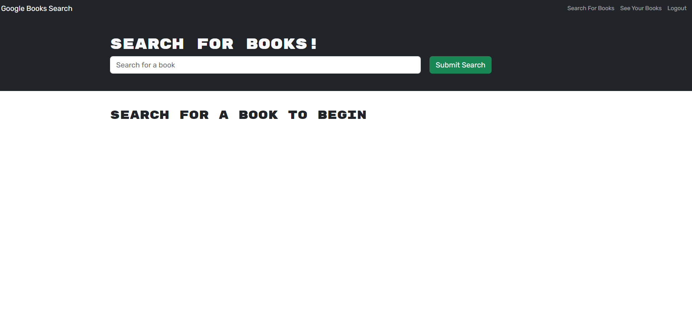
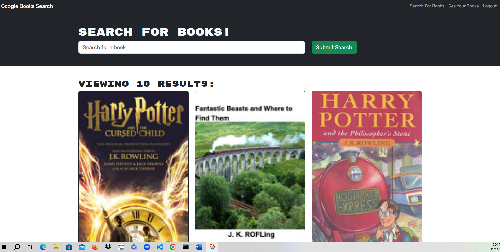
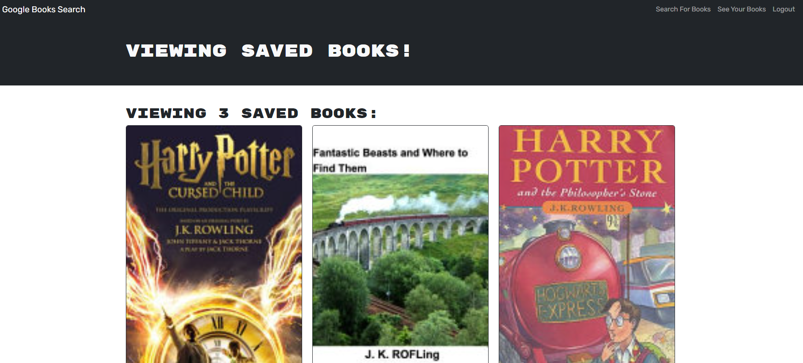

# Book Search Engine

## Description
- Overall this is a MERN (MongoDB, Express.js, REACT.js, Node.js) stack application that includes API functions provided by GraphQL API and an Apollo Server.  The app also uses JSON Web Tokens to secure user data.

- The application searches the Google books api and displays the results. When a user is logged into the application the user is able to save and delete searched books.

## Table of Contents

- [Features](#features)
- [Installation](#installation)
- [Usage](#usage)
- [Contributing](#contributing)
- [License](#license)
- [Credits](#credits)

## Features

This features backend server through use of MongoDB and a front end via REACT.

The Book Search Engine uses the following packages:

- express: for web framework
- mongoose: For Connection to MongoDB
- apollo: for the server
- bcrypt: for encryption
- jsonwebtoken: for tokens on the client side
- graphql: for the API functions
- mongoDB: for the database
- bootstrap: for CSS
- react: for front end

## Installation

To install this application please visit the URL listed below. 

Follow the following URL to the live application: https://cw-book-search-engine-ce53c3e2f3f1.herokuapp.com/

## Usage

    - This is an image of homepage of the application once the user is signed/logged in.

   
    
    -   This screenshot depicts what the application shows if you search for "Harry Potter".

   
    
    -   This image is of the page a user sees when the click on Viewing Saved Books.

## Contributing

    Contributions are welcome.

## License

    MIT

## Support

    If you have any questions or problems with the Application, please create an issue on the GitHub repository: https://github.com/caf62219/book-search-engine.

## Credits

    Donnie Rawlings: https://github.com/drawlin22/
    Kyle Jocoy: https://github.com/Kylyote/
    Nedda Elsayed: https://github.com/Lven-Nemsy
    Colton Firestone: https://github.com/ColtonMakesStuff
    
    Tutor Neil Dhand

    Instructor John Young
    TA Jamie Otto
    
    Ask BCS John Armstrong
    Ask BCS Drew Zinck
    Ask BCS Spider Forrest